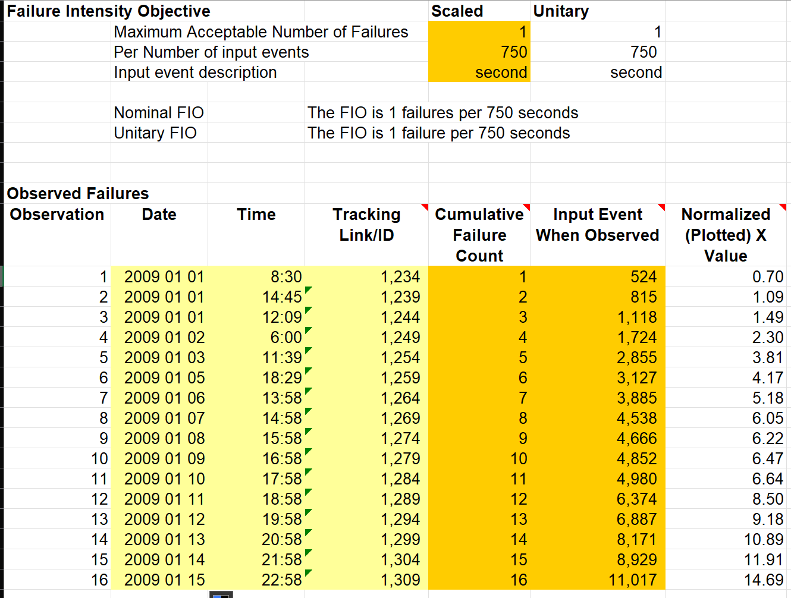
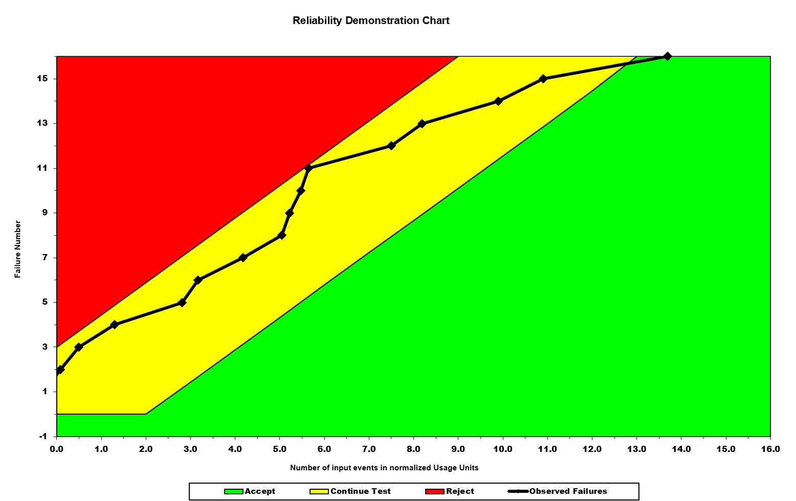
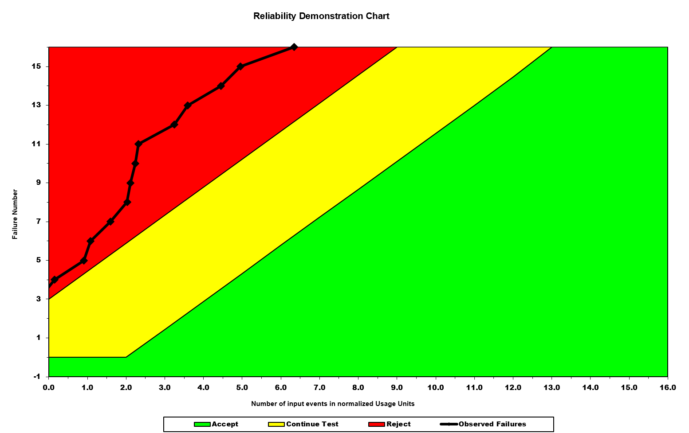
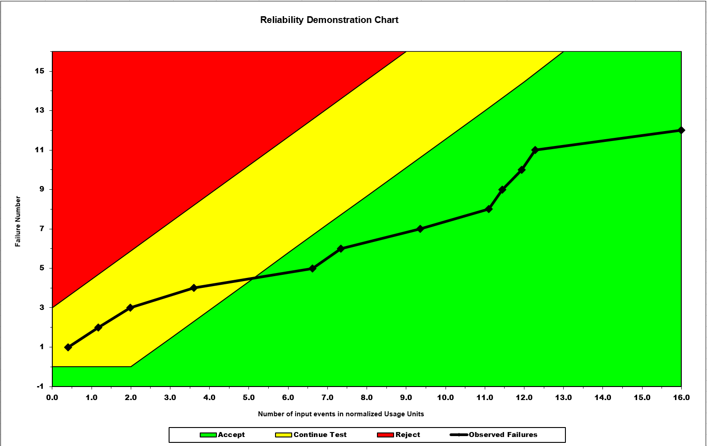

**SENG 438- Software Testing, Reliability, and Quality**

**Lab. Report \#5 – Software Reliability Assessment**

| Group \9:       |   |
|-----------------|---|
| Student Names:  |   |
| Maheen Raza                |   |
| Mehrnaz Zafari                |   |
| Maham Jamal               |   |
| Chloe Villaranda              |   |

# Introduction

For our fifth and final assignment, we are provided with different failure reports that we are expected to convert into different types of graphs in order to understand the overall reliability and failure metrics of a given system. The main purpose of this assignment is to get a deeper understanding of different reliability assessment tools. Through this lab, we are meant to dive into the following ways to assess the given data:

1. Reliability Growth Analysis
2. Reliability Demonstration Chart

Through part 1 of the assignment, we are expected to understand the importance of reliability growth testing, and why certain plots like time-between-failures and failure-count plots are important in determining the overall system reliability.

In part 2 of the assignment, we are expected to understand how MTTF is relevant in terms of testing, and are also expected to become comfortable with tools that implement RDC.

# Assessment Using Reliability Growth Testing 
## Maheen:
### Failure Report 2 Using SRTAT:

In order to decipher failure report 2, in terms of model selection, I only worked with the "Geometric" and "Littlewood and Varral's Bayesian Reliability" models, as the rest of the models would not execute or work on my laptop, so these two models are the ones I decided to select. When looking at these two models, the following conclusions can be made:

Geometric Model:
- The geometric model assume that software failures tend to occur randomly, essentially following a geometric distribution, as indicated by the name.
- The geometric model also tends to be the easiest to understand and implement.

Littlewood and Varral's Bayesian Reliability Model:
- This model assume that software faults tend to occur randomly, and also considers factors like fault removal rates and testing efforts.
- Tends to give us a more realistic view on our failure data.

Above, I used excel in order to plot the failure intensity graph, using the chapter 10 slides from lecture as reference. In order to graph the plot, I used the "failure time" column in the failure report 2 word document as the "cumulative time between failures" data on the x-axis, and calculated the "failure per second" as "error number" over the the "failure time" column in order to get data for the y-axis. Based on this graph, as time progresses, the failures that occur per second starts to drop, indicating a potential increase in system reliability, as there aren't a lot of failures occuring that were occuring originally or as consecutively. 

For the plot above, I also used excel in order to graph the time-between-failures graph, by using the "failure number" column in failure report 2 as the x-axis, and the "time since last failure" column as the y-axis. Based on the peaks of this graph, this indicates that as the number of failures increase, the time between them starts to increase. For example, the peak at error 50 indicates that approxmiately 4000 seconds passed before error 50 occured from the last error that occured. This also indicates a potentially reliable system, as the overall uptime and availability of the system increases when the time between the failures increases, as the system is up for longer before the next failure occurs.

In the above graph, I used the SRTAT Reliability tool to plot the reliability growth analysis plot. In order to generate the plot above, I first took all of the data under the "Time Since Last Failure" column and put it into a text file, which I then fed into the SRTAT tool, and used the littlewood model to generate the above graph, as the geometric model would not generate a graph and would cause my laptop to just load. In the above graph, the prediction line indicates that as time progresses, the overall reliability of our system grows, as the time between the failures grow. Looking at the raw data, the scattered points start to land upwards as time progresses, also verifying the upward trend of our data. 

When looking at the range of data in failure report 2 using the reliability growth analysis graph, the best range of data to use would be to use all of the data. I am basing this on the fact that as number of faliures increase, the time between them also increases, indicating that the overall system reliability starts to increase, as failures don't happen as often or back to back later on. If we were to remove any parts of the data, we would not be able to distinguish if our system reliability is increasing or not. Since failure report 2 is not compatible with the C-SFRAT tool, I could not use Laplace or other tests, as the SRTAT tool does not provide those tests.

I tried inputting a text file that had the failure count data for failure report 2, using the "error number" column, but it would not work, and there was no example of a text file for the SRTAT tool using the failure count data. Every time I tried the different sample data files for SRTAT and inserted them into the SRTAT tool as "failure count", but it would give me the "incorrect file format" error.

Based on the RDC above, I conclude that more test cases or samples are needed in order to decipher if our system can be accepted or rejected, as we are still in the "continue" region. For the "failures per second" value, I simply did the "error number" over the "failure time" values for the first entry to get an idea of what the RDC would look like for our system (1/524).

### J1.DAT File Using C-SFRAT (Bonus):

I also decided to use the C-SFRAT tool to get myself comfortable to using such tools, alongside SRTAT, but SRTAT was the main tool I used. In order to do this, I used the J1.DAT file that was provided under the "failure count" folder in the datasets provided. In order to use C-SFRAT correctly, you must convert the data you have to the following format: Time Interval (T), Failure Count (FC), E (Execution time), Failure Identfication Work (F) and Computer Time for Failure Identification (C). In the J1.DAT file, as well as the rest of the files, we are only provided with only two column, T and FC. Unforunately without the other 3 columns, the tool will not work with the data. I asked other TAs in section 1, and they said to use the other 3 columns from the sample datasets provided, as getting data like "computer time for failure identification" for this provided dataset is nearly impossible. So, I took the E, F and C columns from the ds1.csv file that is provided as sample input for the C-SFRAT tool, and extended the data down using excel, which filled in the rest of the data automatically. Using this excel file, I fed it into the C-SFRAT tool, and got the following graph.

Based on the graph and data above, the best model that worked with the dataset provided was IFR Salvia and Bollinger, with covariates selected as "none".

## Mehrnaz:
### Failure Report 4 Using SRTAT:

  *Time between failures - Geometric*  

By observing the graph, we see that as the failure number increases, the time between failures seems to increase as well, which could imply that the software becomes more stable over time since the failures are happening less frequently.Since the blue line (prediction) follows closely with the given data (red squares), it suggests that the the geometric distribution could be a good model for the data.

  *Time between failures - Littlewood and Varral's Bayesian Reliability Model* 

Similar to the geometric model, Littlewood and Varral's Bayesian graph also displays that the software under test becomes more reliable over time. The majority of the red squares before t=9 are below the prediction curve. This may indicate that the model initially underestimates the time between failures. After t = 9, the red squares are above the prediction line, which suggests that the model overestimates the time between failures later. This crossing pattern suggests the model is capturing the general behaviour of the system but might not be the best fit. 

#### Failure intensity graph 
I was not able to use START to get the failure intensity due to the "incorrect file format!" error, so I used Excel.
Since report 4 only included the failure number and time between failures, in order to get the required data for getting the failure intensity, I added two columns to the report: "cimulative time between failures" and "failure per minute." For the first new column, I used the sum of the previous failure times. For the second new column, I divided the failure counts in each row over the cumulative time between failures. 

The graph starts with a very high failure intensity, which drops sharply within the first time period. Over time, failures become less frequent. The consistent low failure rate suggests the software could be considered reliable in the long term. 

### Advantages of Using Reliability Growth Analysis
Some advantages of using reliability growth analysis is that it helps us track bugs in pre-release, so we know where we are at before we actually release our product. Another benefit is that it helps to guide developers and teams through the software testing process, and helps them to understand how much testing has been done. Another advantage is that it helps teams understand the potential release of a product, as higher system reliability can indicate that a team is closer to releasing the product.

### Disadvantages of Using Reliability Growth Analysis
Some disadvantages of using reliability growth analysis is that they are just predictions of our reliability, and might not actually be an accurate display of the actual system reliability. Another disadvantage, that we all faced, was struggling to get data available in order to use reliability growth analysis. A lot of data was missing and was just hard to get.

# Assessment Using Reliability Demonstration Chart 

Using a Reliability Demonstration Chart (RDC) is an effective way to check whether the target failure rate is met or not. It is based on collecting failure data at time points. For this part of the assignment, we used data from report 2. In the interest of simplification, the first 16 datapoints were used.

To define the criteria for selecting a suitable MTTF, we decided to choose the MTTF that would cause the graph to begin in the "Continue" region with the following data trending towards the "Accept" region, amd no data points ever crossing into the "Reject" region. This value was found using trial and error, adjusting the maximum acceptable number of failures per number of event inputs. 

## Minimum MTTF:

Max Number of failures per 750 seconds is 1 failure 
λ = 1 failure / 750 seconds = 0.0013 failures/s

MTTFmin = 750 / 1 = 750 seconds 

You can see the RDC for MTTFmin below:

## Twice the Minimum MTTF

2 * MTTFmin = 750 * 2 = 1500 seconds
λ = 1 failure / 1500 seconds = 0.00067 failures/s

This caused all the data points to lie within the "Reject" region, indicating a higher risk of failure.

## Half the Minimum MTTF

1/2 MTTFmin = 1/2 * 750 = 375 seconds
λ = 1 failure / 375 seconds = 0.00267 failures/s

This caused the data points to shift to the right, but the same general trend of the data starting within the "Continue" region and trending towards the "Accept" region is observed. This indicates a lower risk of failure.

## Advantages and Disadvantages of RDC

# Comparison of Results
Both Reliabilty Growth Testing and RDC were done on report 2. In Part 1, we worked with the Geometric and Littlewood and Varral's Bayesian Reliability models. Comparing part 1's Failure Intensity Graph with failure per second as the y and culmulative time between failures on the x axis, we can see that it complements the points on the reliability demonstration chart nicely. The Failure Intensity Graph has a downward slope and the RDC as an upward slope. 
The individual points and their spacing between one another on the RDC match the Time Between Failures graph in Part 1.

### Using Reliability Growth Analysis:

Using reliability growth analysis as a technique can help understand if our SUT is undergoing reliability growth, decrease, or if the overall system is exhibiting stable reliability.

### Using Reliability Demonstration Chart:

Using RDC is a simple and efficient way to help understand and visualize what the MTTFmin would be as the user is able to clearly see the reject, continue, and accept regions and evaluate their SUT accordingly. 

# Discussion on Similarity and Differences of the Two Techniques
Some of the similarities include that both the RDC and RGT assess the reliability of the system over time and both of them rely on statistical analysis from data like a range of input failure data to determine this kind of information. Additionally, both techniques require the modifications of certain parameters like the failure rates, risk values, MTTFmin, models used, etc.

As for differences, RDC is much more simpler to use than RGT. The learning curve to use RDC is much less steeper and can e done in an intuitive way. The charts generated are easy to manipulate as well as easy to interpret. RGT, in comparison to RDC, has more tools but in turn can offer the ability to predict possible failures based on the data and trend analysis. As such, the additional features that RGT has allows for a more in depth anaylsis. 

# How the team work/effort was divided and managed
 Group work was divided up by having two people work on part 1 of the assignment, so focusing on reliability growth analysis, and having the other two members work on part 2 of the assignment, so focusing on reliability demonstration chart.

# Difficulties encountered, challenges overcome, and lessons learned
This assignment, by far, was one of the most difficult and confusing assignments of this course. Difficulties I encountered were trying to get used to the different reliability tools we got like SRTAT and C-SFRAT, and attempting to convert the given failure data into the appropriate format for the tools. A lot of the data we had gotten had no correlation and had chunks of information missing that were needed to get tools like C-SFRAT to actually work.

# Comments/feedback on the lab itself
For this assingment, I wish we were given more cohesive and specific instructions, as the instructions we were given were very vague and not as helpful when completing this assignment.